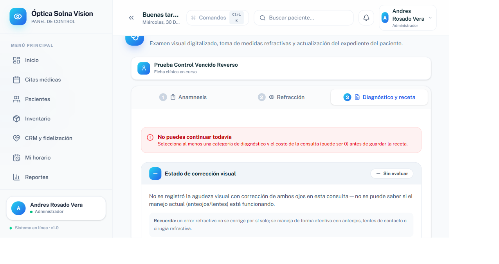
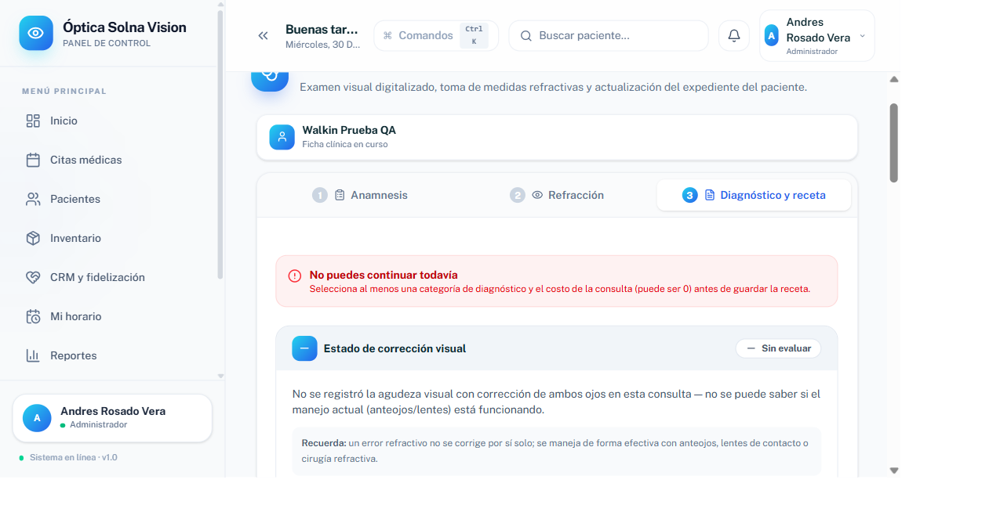

# Bug reproducido: validación prematura en "Diagnóstico y receta"

**Fecha**: 2026-09-30
**Metodología**: solo lectura de código + QA en vivo con Playwright sobre el sistema en local (`npm run dev`, puerto 5174), sesión de Andres Rosado Vera (administrador). No se guardó ninguna ficha clínica — cada reproducción se descartó con "Salir de todas formas" / "Cerrar ficha clínica" antes de confirmar el guardado. Se usaron solo pacientes/citas de prueba (`Prueba Control Vencido Reverso`, `Walkin Prueba QA`).

**Origen**: `docs/feedback-ing/reunion-zoom-29sep.md`, líneas 37-39 (minuto ~11-13 del Video 1):
> Ing. Supervisor: Me pide seleccionar una categoría de diagnóstico. Bueno, esto está bugeado aquí. Diagnóstico y receta.
> Tesista: Es que está la receta.

Este punto **no quedó registrado como fila propia** en `docs/feedback-ing/plan-reunion-29sep.md` (el análisis de esa reunión cubre motivo de consulta, antecedentes duplicados y tendencia de graduación, pero no este comentario puntual) — de ahí el pedido de reproducirlo hoy.

---

## Resumen del hallazgo

**Sí hay un bug real, reproducible 4/4 veces con dos pacientes de prueba distintos.** No es un malentendido ("es que está la receta") ni una validación que funcione como se espera: es una condición de carrera real del navegador que hace que, al hacer clic en "Siguiente" para entrar a "Diagnóstico y receta", el formulario **se autoenvíe** una fracción de segundo antes de que el usuario haya podido ver la pantalla, mostrando de inmediato el error "Selecciona al menos una categoría de diagnóstico" — exactamente lo que describió el ing.

### Captura del bug



Banner rojo "No puedes continuar todavía — Selecciona al menos una categoría de diagnóstico y el costo de la consulta (puede ser 0) antes de guardar la receta", visible **apenas se entra al paso 3**, antes de tocar nada en él.

Reproducido de nuevo con un segundo paciente de prueba, sin ninguna relación con el primero (ficha en curso distinta, sin datos compartidos):



---

## Causa raíz (identificada en código, sin modificarlo)

El botón inferior de navegación del wizard (`src/paginas/ConsultaMedica.jsx:2530-2546`) usa un único slot condicional para dos botones distintos:

```jsx
{subTab !== "diagnostico" ? (
  <button type="button" onClick={() => irA(...)}>
    Siguiente <ArrowRight size={15} />
  </button>
) : !fichaGuardada ? (
  <button type="submit">
    <Save size={15} /> Guardar ficha clínica
  </button>
) : ( ... )}
```

Ambos botones ocupan la **misma posición en el árbol de JSX, sin `key` que los distinga**. Cuando React reconcilia el cambio de paso Refracción → Diagnóstico, en vez de desmontar el botón "Siguiente" (`type="button"`) y montar uno nuevo, **reutiliza el mismo nodo del DOM** y solo le cambia el atributo `type` a `"submit"`.

El problema es el orden de eventos de un clic real de mouse:

1. El clic dispara el evento nativo `click` sobre el botón (en ese instante todavía es `type="button"`).
2. React ejecuta el `onClick` → `irA("diagnostico")` → `setSubTab("diagnostico")` → **re-render síncrono** dentro del mismo despacho del evento.
3. Ese re-render muta el `type` del mismo nodo DOM a `"submit"` **antes de que el navegador termine de procesar el clic**.
4. El navegador evalúa el "activation behavior" del clic (¿es esto un botón de envío?) **al final** del despacho del evento — y para entonces el nodo ya dice `type="submit"` → dispara `form.requestSubmit()`.
5. Eso ejecuta `intentarGuardar` (`ConsultaMedica.jsx:821-835`), el manejador de **envío del formulario completo**, que valida los 3 pasos (Anamnesis, Refracción, Diagnóstico) de una vez. Anamnesis y Refracción pasan (ya están llenos); Diagnóstico falla porque el usuario acaba de llegar y no ha elegido nada — y el propio `intentarGuardar` fuerza `setSubTab("diagnostico")` + el banner de error, **aunque el usuario ya estaba yendo hacia ahí por su cuenta**.

Esto se confirmó de forma instrumentada (sin editar el archivo fuente): se agregó un listener temporal de `submit` sobre el `<form>` vía consola del navegador y se registró que **un solo clic real en "Siguiente" dispara exactamente 1 evento `click` en el botón + 1 evento `submit` en el formulario** — ese `submit` no debería poder ocurrir nunca desde ese botón.

### Evidencia de que es justo este mecanismo (y no otra cosa)

| Prueba | Resultado |
|---|---|
| Clic real de mouse (`page.locator(...).click()` / `getByRole().click()`) en "Siguiente" desde Refracción | ❌ Bug se reproduce (4/4 intentos, 2 pacientes distintos) |
| Clic directo en la pestaña **"3 Diagnóstico y receta"** del stepper de arriba (tiene `key` propio, nunca cambia de `type`) | ✅ Limpio, sin error — confirma que el problema es específico del botón compartido "Siguiente"/"Guardar", no de la navegación en general |
| `el.click()` (método DOM nativo) en "Siguiente" | ✅ Limpio — no siempre alcanza a reproducir el mismo timing de evento nativo |
| `dispatchEvent(new MouseEvent('click'))` sintético (con o sin mousedown/mouseup previos) | ✅ Limpio — un evento sintético no disparado por el navegador no llega a activar el "activation behavior" nativo de envío de formulario |
| Clic real de Anamnesis → Refracción (mismo botón, pero ahí NO cambia de `type` porque las dos veces es "Siguiente") | ✅ Limpio siempre — refuerza que el disparador es específicamente el cambio de `type` |

Es decir: el bug depende del **clic real con mouse**, que es justo la forma en que el ing interactúa con el sistema — no es un artefacto de la automatización, es más bien lo opuesto: la automatización con clics sintéticos lo *esconde*, y solo un clic de verdad lo expone.

No se encontró ningún error en la consola del navegador ni en Network (0 errores/advertencias en toda la sesión, todas las peticiones a Supabase en `200`) — el bug es silencioso: no rompe nada visiblemente en devtools, solo arruina la primera impresión del paso 3.

### Por qué "es que está la receta" no es la explicación

La respuesta del tesista en la reunión sugiere que se interpretó el comentario del ing como una confusión sobre la vista previa de la receta (que en efecto se muestra junto con los campos de diagnóstico en el mismo paso). Pero el comentario del ing ("me pide seleccionar una categoría... esto está bugeado") describe con precisión el síntoma que se reprodujo acá: el sistema **exige** algo antes de que el usuario haya tenido oportunidad de completarlo — no una confusión sobre el layout.

---

## Corrección sugerida (no aplicada — solo lectura, según lo pedido)

Cualquiera de estas dos opciones, aplicada a `ConsultaMedica.jsx:2530-2546`, elimina la causa raíz:

1. Dar un `key` distinto a cada rama del ternario (ej. `key="btn-siguiente"` vs `key="btn-guardar"`), forzando a React a desmontar/montar en vez de mutar el nodo existente.
2. Separar "Guardar ficha clínica" en un botón `type="button"` con `onClick={() => formRef.current.requestSubmit()}` (o llamar a `intentarGuardar` directamente), en vez de depender de `type="submit"` + reconciliación de nodo compartido.

La opción 1 es el cambio mínimo y más seguro.

---

## Otros hallazgos menores durante la reproducción (no bloqueantes, no eran el foco del pedido)

1. **"Otro" como categoría de diagnóstico no es realmente obligatorio en el detalle**, pese a que la UI lo presenta así ("el detalle deja de ser una nota opcional... es la única fuente del diagnóstico", comentario en `ConsultaMedica.jsx:2006-2010`). `validarPaso("diagnostico")` (`ConsultaMedica.jsx:1065-1070`) solo exige que `diagnosticoCategorias` no esté vacío y que `costoConsulta` sea un número — nunca valida que, si la categoría es "Otro", el textarea de detalle tenga contenido. En teoría se podría guardar una receta con diagnóstico = "Otro" sin ninguna descripción. No se pudo confirmar guardando de verdad (bloqueado intencionalmente por no tener autorización para guardar), pero el código de validación es inequívoco en este punto.
2. No se observaron bloques de la receta superpuestos o mal alineados en ningún paso, con o sin "Otro" seleccionado, con o sin "Añadir recomendación de lente" — el layout se ve correcto en las capturas 04, 06 y 07.
3. El buscador de paciente dentro de la ficha (el hallazgo de "no debería aparecer si ya estoy en el paciente", ING9/29-sept) sigue efectivamente ausente al entrar por "Atender" — confirmado en ambas repeticiones (capturas 02).

---

## Capturas incluidas

| Archivo | Contenido |
|---|---|
| `01-modal-resumen-cita-historial.png` | Modal "Resumen de la cita" antes de entrar a la ficha (paciente con historial) |
| `02-ficha-abre-historial.png` | Ficha clínica recién abierta, paso Anamnesis, sin buscador de paciente |
| `03-refraccion-historial.png` | Paso Refracción con comparación contra visita anterior |
| `04-BUG-diagnostico-error-inmediato.png` | **Bug reproducido** — banner de error al llegar a Diagnóstico (1er paciente) |
| `05-diagnostico-limpio-via-tab.png` | Mismo paso, llegada limpia al hacer clic en la pestaña del stepper en vez de "Siguiente" |
| `06-categoria-otro-seleccionada.png` | Categoría "Otro" seleccionada, textarea de detalle visible |
| `07-BUG-segundo-paciente-walkin.png` | **Bug reproducido** — segundo paciente de prueba, ficha independiente |

Las citas de prueba usadas (`Prueba Control Vencido Reverso`, `Walkin Prueba QA`) quedaron en estado "En Atención" tras esta sesión — es el comportamiento esperado al usar "Atender"/"Paciente en atención", no un efecto secundario del bug. Ninguna ficha clínica ni factura fue guardada (0 inserciones a `consultas` o `facturas_venta` en las peticiones de red de la sesión).
